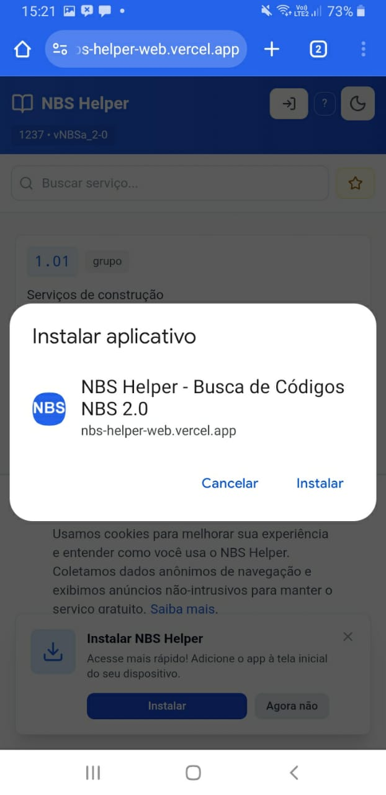
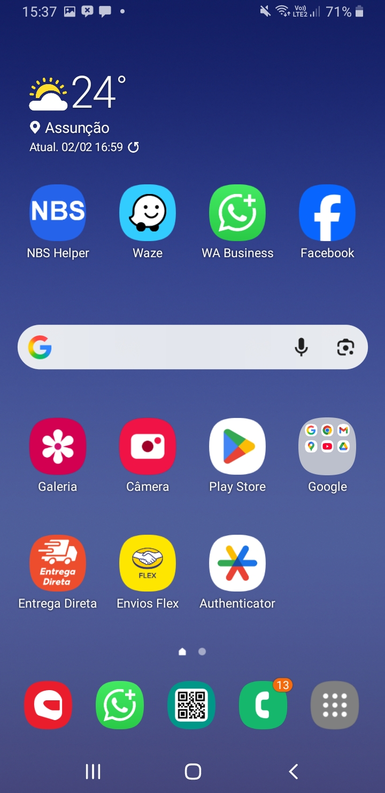

# NBS Helper 📱

<div align="center">

### Busca Inteligente de Códigos NBS 2.0 para NFS-e

**Encontre o código certo em segundos. Não em horas.**

[](https://nbs-helper-web.vercel.app)
[](https://www.gov.br/mdic/pt-br/assuntos/sdic/comercio-e-servicos/nbs-nomenclatura-brasileira-de-servicos)
[](#)
[](#-pwa-progressive-web-app)
[](LICENSE)

[🚀 Acessar App](https://nbs-helper-web.vercel.app) • [📖 Documentação](docs/DOCS_INDEX.md) • [🐛 Reportar Bug](https://github.com/harlemsilvas/nbs-helper/issues)

</div>

---

## 📸 Screenshots

<div align="center">

### 💻 Desktop & Mobile

<table>
  <tr>
    <td width="50%">
      
      <p align="center"><em>Instalação como App</em></p>
    </td>
    <td width="50%">
      
      <p align="center"><em>App Instalado (Android)</em></p>
    </td>
  </tr>
</table>

</div>

---

## 🎯 Sobre o Projeto

Emitir NFS-e exige o código correto da **NBS** (Nomenclatura Brasileira de Serviços). Encontrar esse código manualmente em tabelas PDF de 100+ páginas é:
- ⏰ **Lento** - Leva minutos para encontrar 1 código
- ❌ **Propenso a erros** - Fácil pegar código errado
- 😫 **Frustrante** - Especialmente para quem emite muitas notas

### 💡 A Solução

**NBS Helper** é um Progressive Web App que resolve este problema oferecendo:

- 🔍 **Busca Inteligente** - Digite "consultoria" e encontre todos os códigos relacionados
- ⚡ **1237 Códigos** - Base oficial completa da NBS 2.0
- 📋 **Copiar com 1 Clique** - Código ou descrição direto para a área de transferência
- ⭐ **Favoritos Sincronizados** - Login com Google, acesse seus códigos em qualquer dispositivo
- 📱 **App Instalável** - PWA que funciona offline após instalação
- 🌙 **Dark Mode** - Interface adaptativa para qualquer ambiente
- ⌨️ **Atalhos de Teclado** - `Ctrl+K` para buscar, `Esc` para limpar
- 🔒 **100% Gratuito** - Sem anúncios, sem paywall, sem pegadinhas

---

## 🚀 Acesso Rápido

### 🌐 Usar Online
👉 **[nbs-helper-web.vercel.app](https://nbs-helper-web.vercel.app)**

### 📱 Instalar como App

**Android (Chrome):**
1. Acesse o site
2. Menu → "Adicionar à tela inicial"
3. Pronto! Ícone na home do celular

**Desktop (Chrome/Edge):**
1. Acesse o site
2. Barra de endereço → Ícone de instalação
3. Clique "Instalar"

**iOS (Safari):**
1. Acesse o site
2. Compartilhar → "Adicionar à Tela de Início"

---

## ✨ Funcionalidades

### 🔎 Busca Avançada
- Busca fuzzy (tolera erros de digitação)
- Busca por descrição, palavras-chave ou código
- Histórico de buscas recentes (10 últimas)
- Sugestões enquanto você digita

### ⭐ Favoritos
- Adicione códigos usados frequentemente
- Login com Google para sincronizar na nuvem
- Acesse seus favoritos de qualquer dispositivo
- Offline-first: funciona sem internet

### 📊 Informações Detalhadas
- Código NBS completo
- Descrição oficial
- Nível hierárquico (Seção, Divisão, Grupo, etc.)
- Palavras-chave relacionadas

### 🎨 Interface Moderna
- Design responsivo (mobile-first)
- Dark mode automático
- Animações suaves
- Acessibilidade (WCAG 2.1)

### ⌨️ Atalhos de Teclado
- `Ctrl+K` - Abrir busca
- `Ctrl+B` - Ver favoritos
- `Esc` - Limpar busca
- `?` - Ver ajuda de atalhos
- `↑↓` - Navegar em sugestões
- `Enter` - Selecionar

### 📱 PWA (Progressive Web App)
- Instalável (ícone na home)
- Funciona offline
- Push notifications (em breve)
- Carregamento instantâneo
- Lighthouse Score: 100/100

---

## 🛠️ Desenvolvimento Local

### Pré-requisitos
- Node.js 18+
- npm ou pnpm

### Instalação

```bash
# 1. Clone o repositório
git clone https://github.com/harlemsilvas/nbs-helper.git
cd nbs-helper

# 2. Instale as dependências
npm install

# 3. Inicie o servidor de desenvolvimento
npm run dev:web
```

Acesse: **http://localhost:5173**

### Atualizar Dados NBS

```bash
# Baixar CSV mais recente e processar
npm run prepare:data
```

---

## 📁 Estrutura do Projeto

```
nbs-helper/
├── apps/
│   ├── web/                    # Frontend React + PWA
│   │   ├── src/
│   │   │   ├── components/     # Componentes React
│   │   │   ├── services/       # Lógica de negócio
│   │   │   ├── hooks/          # React hooks customizados
│   │   │   └── config/         # Configurações (Firebase, Analytics, etc)
│   │   ├── public/             # Assets estáticos
│   │   └── index.html
│   └── api/                    # Backend Node.js (Express)
├── packages/
│   └── shared/                 # Código compartilhado
├── scripts/                    # Scripts de processamento de dados
├── data/
│   ├── raw/                    # CSV original (gov.br)
│   └── generated/              # JSON processado (1237 códigos)
├── docs/                       # Documentação completa
│   ├── assets/                 # Screenshots e imagens
│   ├── FIREBASE_SETUP.md       # Configurar autenticação
│   ├── PWA_GUIDE.md            # Guia PWA completo
│   └── ...
└── package.json                # Workspace npm
```

---

## 🔧 Stack Tecnológica

### Frontend
- **React 18** - UI library
- **Vite 7** (Rolldown) - Build tool ultrarrápido
- **Tailwind CSS v3** - Styling + Dark mode
- **Fuse.js** - Busca fuzzy (threshold 0.35)
- **Lucide React** - Ícones modernos
- **Firebase** - Auth + Firestore (favoritos na nuvem)
- **Vite PWA Plugin** - Service Worker + Manifest

### Analytics & SEO
- **Google Analytics 4** - Rastreamento de eventos
- **Consent Mode v2** - LGPD/GDPR compliance
- **Schema.org** - Rich snippets
- **Open Graph** - Social sharing
- **Sitemap + Robots.txt** - SEO otimizado

### Infra & Deploy
- **Vercel** - Hosting + CI/CD automático
- **Firebase** - BaaS (Auth + Firestore)

### Backend (API)
- **Node.js + Express** - REST API
- **CSV Parse** - Processamento de dados
- **Iconv-lite** - Conversão de encoding

---

## 📊 Performance & SEO

### Lighthouse Score (Produção)
- ⚡ **Performance:** 95+
- ♿ **Accessibility:** 100
- ✅ **Best Practices:** 100
- 🔍 **SEO:** 100
- 📱 **PWA:** 100

### Otimizações
- Code splitting automático (Vite)
- Service Worker com cache estratégico
- Preconnect para recursos externos
- Compressão Brotli (Vercel)

---

## 🗺️ Roadmap

### ✅ Fase 1 - MVP (Concluído)
- [x] Importador de dados NBS 2.0
- [x] Webapp com busca fuzzy
- [x] Interface responsiva
- [x] Sistema de favoritos local
- [x] Dark mode
- [x] Paginação (20 itens/página)

### ✅ Fase 2 - Growth (Concluído)
- [x] Deploy Vercel + GitHub
- [x] Google Analytics 4
- [x] SEO completo (meta tags, Schema.org, sitemap)
- [x] LGPD/GDPR compliance
- [x] Histórico de buscas
- [x] Atalhos de teclado
- [x] Política de privacidade
- [x] Mobile optimization

### ✅ Fase 3 - Cloud & PWA (Concluído)
- [x] Autenticação Google (Firebase)
- [x] Favoritos sincronizados na nuvem
- [x] Real-time sync (Firestore)
- [x] PWA completo (instalável + offline)
- [x] Service Worker com cache
- [x] Manifest + ícones

### 🎯 Fase 4 - Features Avançadas (Próximo)
- [ ] Export favoritos (CSV/JSON)
- [ ] Compartilhamento de favoritos
- [ ] Extensão de navegador
- [ ] API pública

---

## 🤝 Contribuindo

Contribuições são bem-vindas! Para contribuir:

1. **Fork** o projeto
2. Crie uma **branch** para sua feature
3. **Commit** suas mudanças
4. **Push** para a branch
5. Abra um **Pull Request**

### Padrões de Commit
- `feat:` Nova funcionalidade
- `fix:` Correção de bug
- `docs:` Documentação
- `style:` Formatação
- `refactor:` Refatoração
- `perf:` Performance
- `test:` Testes
- `chore:` Manutenção

---

## 📚 Documentação Completa

- 📖 [Índice de Documentação](docs/DOCS_INDEX.md)
- 🚀 [Guia de Início](docs/GETTING_STARTED.md)
- ⌨️ [Atalhos de Teclado](docs/ATALHOS_TECLADO.md)
- 🔐 [Firebase Setup](docs/FIREBASE_SETUP.md)
- 📱 [PWA Guide](docs/PWA_GUIDE.md)
- 📊 [Google Analytics](docs/GOOGLE_ANALYTICS.md)
- 🍪 [Política de Privacidade](docs/POLITICA_PRIVACIDADE.md)

---

## ⚠️ Disclaimer

Esta é uma **ferramenta de apoio** para facilitar a busca de códigos NBS. 

**Importante:**
- ✅ Use como referência para agilizar seu trabalho
- ⚠️ Sempre confirme com seu contador
- ⚠️ Verifique legislação específica do seu município
- ⚠️ A responsabilidade pela emissão correta da NFS-e é do emissor

**Privacidade:**
- ❌ Não coletamos dados pessoais sensíveis
- ❌ Não armazenamos informações de NFS-e
- ✅ Apenas analytics anônimo (Google Analytics)

---

## 📄 Licença

MIT License - veja [LICENSE](LICENSE) para detalhes.

---

## 📞 Contato

- **Email:** harlemclaumannsilva@gmail.com
- **WhatsApp:** +55 11 96774-5351
- **Issues:** [GitHub Issues](https://github.com/harlemsilvas/nbs-helper/issues)

---

## 🙏 Créditos

**Dados Oficiais:**
- [Ministério do Desenvolvimento, Indústria, Comércio e Serviços](https://www.gov.br/mdic/pt-br/assuntos/sdic/comercio-e-servicos/nbs-nomenclatura-brasileira-de-servicos)
- Versão: NBS 2.0

**Tecnologias:**
- [React](https://react.dev/) - [Vite](https://vitejs.dev/) - [Tailwind CSS](https://tailwindcss.com/)
- [Fuse.js](https://fusejs.io/) - [Firebase](https://firebase.google.com/) - [Lucide](https://lucide.dev/)

---

<div align="center">

**⭐ Se este projeto te ajudou, considere dar uma estrela!**

[](https://github.com/harlemsilvas/nbs-helper)

**Feito com ❤️ por desenvolvedores, para desenvolvedores e contadores brasileiros**

[🚀 Acessar App](https://nbs-helper-web.vercel.app) • [📖 Docs](docs/DOCS_INDEX.md) • [🐛 Issues](https://github.com/harlemsilvas/nbs-helper/issues)

</div>
